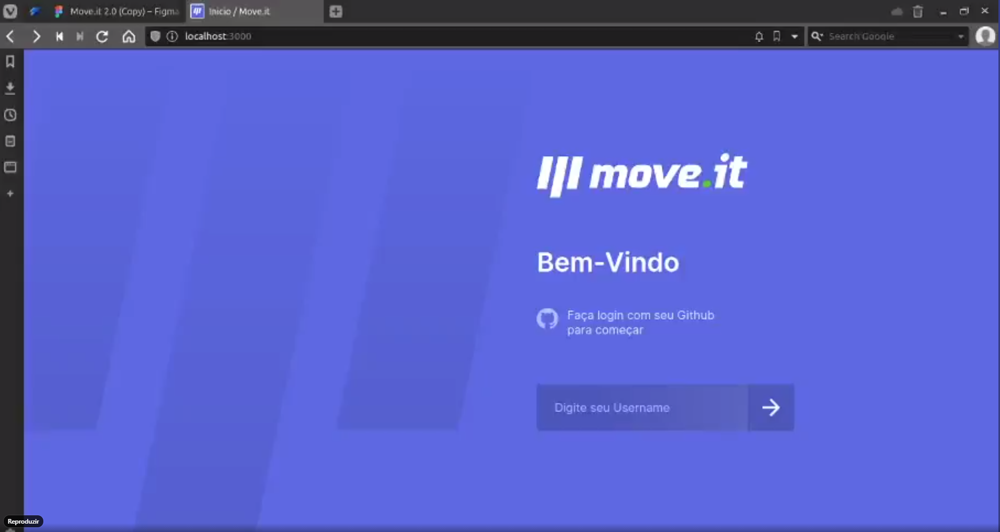

<h1 align="center">
  
</h1>

 <a href="#-about">Sobre</a>&nbsp;&nbsp;&nbsp;|&nbsp;&nbsp;&nbsp; 
 <a href="#-layout">Layout</a>&nbsp;&nbsp;&nbsp;|&nbsp;&nbsp;&nbsp;
 <a href="#-tech">Tecnologias</a>&nbsp;&nbsp;&nbsp;|&nbsp;&nbsp;&nbsp;
 <a href="#-license">Licença</a>

## 💻 Sobre

Projeto feito durante a <strong>Next Level Week #4</strong> da <a href="http://app.rocketseat.com.br">Rocketseat</a>. O intuito do evento era  realizar o desenvolvimento de uma aplicação web voltada para todos que ficam diariamente á frente do computador através do uso de tecnologias que estão em alta no mercado (ReactJS - Foco em utilização do NextJS).

A ideia é de que o usuário inicie  um ciclo de 25 minutos e a  cada 25 minutos  seja lembrado de fazer uma pausa e, durante a pausa, realizar um exercício específico que a aplicação disponibiliza. Após a realização do exercício o usuário confirma que realizou o exercício e recebe uma motivação (no caso foi utilizado a temática de RPGs, como ganhar experiência para subir de level.) e segue para o próximo ciclo.

## 🎨 Layout

<pd>
  Pode ver o layout original do projeto através deste <a href="https://www.figma.com/file/ge20pu3ofMOKoliUyKx1Nl/Move.it-1.0/" alt="Link para o layout">link</a>. É necessário uma conta no <a href="https://figma.com/" alt="Homepage do Figma">Figma</a> para acessá-lo.

## 🚀 Tecnologias

O projeto foi desenvolvido com as seguintes tecnologias:

- **[ReactJS](https://developer.mozilla.org/en-US/docs/Glossary/HTML)**
- **[NextJS](https://sass-lang.com/documentation/syntax)**
- **[Styled-Compoents](https://sass-lang.com/documentation/syntax)**

## 🌏 Como Iniciar o projeto

- **git clone https://github.com/JcscJosecarlossilvacoelho/Nlw-MoveIt.git**
- **yarn install**
- **yarn dev**

## 🖼️ Imagen do Projeto

<h1 align="center">
  
</h1>

## 🖊️ Licença

O projeto é licenciado sobre a "MIT License" - Veja a pagina LICENÇA para mais destalhes.
